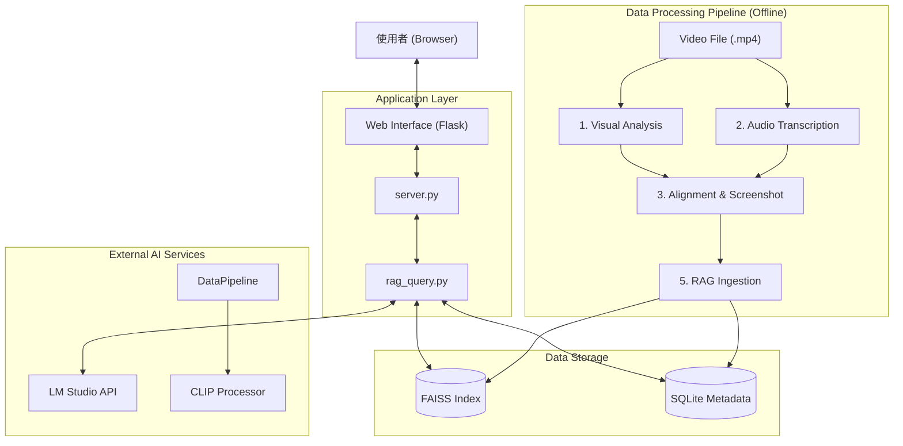
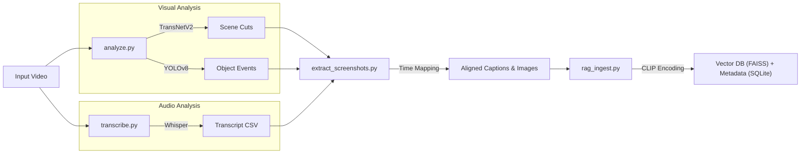
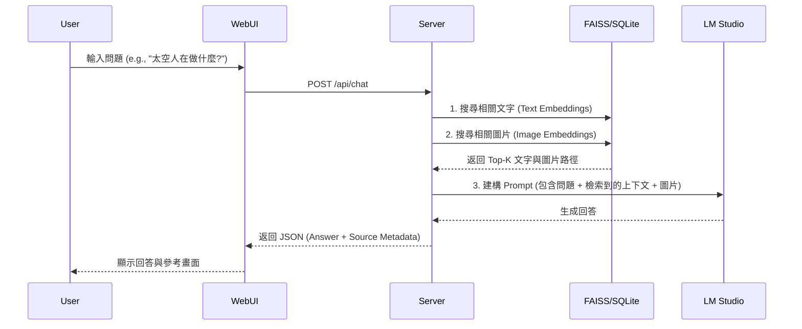

# Multimodal Video Analysis and RAG Retrieval System

## 專案總覽 (Project Overview)

本專案是一個整合 **多模態影片分析 (Multimodal Video Analysis)** 與 **檢索增強生成 (RAG, Retrieval-Augmented Generation)** 的智慧問答系統。

*   **專案用途**: 自動化處理長影片，提取關鍵視覺與聽覺資訊，並允許使用者透過自然語言進行內容檢索與問答。
*   **解決的問題**: 解決傳統影片搜尋僅能針對標題或標籤，無法深入影片內容（如特定對話、畫面細節）進行精確檢索的問題。
*   **使用對象**: 需快速檢索大量影片內容的研究人員、媒體工作者或檔案管理員。
*   **專案性質**: Full-stack Application (Python Backend Services + Flask Web App).

---

## 系統架構說明 (Architecture Overview)

本系統採用模組化設計，分為 **資料處理管線 (Data Pipeline)** 與 **應用服務層 (Application Layer)**。

*   **資料處理管線**: 負責非同步處理影片，包含電腦視覺分析 (TransNetV2, YOLOv8) 與語音轉錄 (Whisper)。
*   **向量資料庫**: 使用 FAISS 儲存 High-dimensional Embeddings (CLIP)，SQLite 儲存 Metadata。
*   **應用服務**: Flask 提供 RESTful API 與 Web UI，整合 LM Studio 進行大型語言模型推論。



---

## 系統流程說明 (System Flow)

系統運作分為 **離線建立索引 (Indexing Phase)** 與 **線上檢索 (Query Phase)** 兩大階段。

### 1. 離線處理流程 (Indexing)


### 2. 線上檢索流程 (Query)


---

## 資料夾結構說明 (Folder Structure)

```
Project Root
├── 1_關鍵偵擷取/              # [視覺模組] 影片切割與物件偵測
│   ├── analyze.py           # 主程式：整合 TransNetV2 與 YOLOv8
│   ├── TransNetV2/          # (依賴) 場景偵測模型
│   └── keyframes/           # (產出) 偵測到的關鍵影格圖片
│
├── 2_逐字稿擷取/              # [語音模組] 影片轉文字
│   ├── transcribe.py        # 主程式：呼叫 OpenAI Whisper
│   └── transcript.csv       # (產出) 包含時間戳記的逐字稿
│
├── 3_逐字稿圖片擷取/          # [整合模組] 圖文對齊
│   ├── extract_screenshots.py # 主程式：依據 transcript 時間擷取圖片
│   └── screenshots/         # (產出) 對應每一句對話的截圖
│
├── 5_RAG_database/          # [檢索模組] RAG 核心與網頁伺服器
│   ├── input/               # [資料源] 需手動匯集前述步驟的產出至此
│   ├── rag_ingest.py        # 建置程式：讀取 input/ 建立向量索引
│   ├── rag_query.py         # 檢索核心：負責搜尋 FAISS 與呼叫 LLM
│   ├── server.py            # 網頁後端：Flask Entry Point
│   ├── static/              # 前端靜態資源 (CSS, JS)
│   ├── templates/           # 前端 HTML 樣板
│   ├── rag_mm.db            # (產出) SQLite 資料庫
│   └── *.index              # (產出) FAISS 向量索引檔
│
└── README.md                # 專案說明文件
```

---

## 核心模組與重要檔案 (Key Modules & Files)

| 檔案名稱 | 所屬模組 | 職責 (Responsibility) | 依賴關係 |
| :--- | :--- | :--- | :--- |
| **analyze.py** | 關鍵偵擷取 | 執行 TransNetV2 偵測場景切換，執行 YOLOv8 追蹤物件。輸出 CSV 報告與關鍵影格。 | `tensorflow`, `ultralytics`, `ffmpeg-python` |
| **transcribe.py** | 逐字稿擷取 | 載入 Whisper 模型將音訊轉為帶時間戳的文字。 | `openai-whisper` |
| **extract_screenshots.py** | 整合模組 | 讀取 `transcript.csv`，利用 OpenCV 依據 `Start/End Time` 從影片截圖。 | `opencv-python`, `pandas` |
| **rag_ingest.py** | RAG 資料庫 | 讀取圖像與文字，使用 CLIP 模型計算 Embeddings，寫入 FAISS 與 SQLite。 | `transformers`, `faiss-cpu`, `torch` |
| **rag_query.py** | RAG 資料庫 | 提供 `query_rag_api` 函數。執行向量相似度搜尋，並封裝 Context 發送給 LM Studio。 | `openai`, `faiss-cpu` |
| **server.py** | Web 介面 | Flask Server，提供 API Endpoints 與渲染前端頁面。 | `flask` |

---

## 安裝與環境需求 (Installation & Requirements)

### 系統需求
*   **OS**: Windows 10/11 (本專案路徑結構基於 Windows)
*   **Python**: 3.8 ~ 3.10
*   **GPU (Optional)**: 強烈建議使用 NVIDIA GPU 加速 Whisper 與 Embedding 計算。

### 外部依賴
1.  **FFmpeg**: 必須安裝並加入系統 PATH。
2.  **LM Studio**: 必須安裝並運行 Local Inference Server。
    *   **Model**: 建議使用 Vision-Language Model (如 `Qwen2-VL`, `LLaVA`)。
    *   **Port**: 預設 `1234`。

### Python 套件安裝
```bash
pip install -r requirements.txt
# 或手動安裝核心套件：
pip install openai-whisper ultralytics opencv-python pandas numpy tqdm flask faiss-cpu transformers torch pillow ffmpeg-python openai
```
*(註: 若使用 GPU，請將 `faiss-cpu` 替換為 `faiss-gpu`，並安裝對應 CUDA 版本的 PyTorch)*

---

## 使用方式 (How to Use)

本系統設計為**依序執行 (Sequential Execution)**。假設您的來源影片為 `test.mp4`。

### Phase 1: 資料前處理 (Data Preprocessing)

1.  **視覺分析**:
    ```bash
    cd 1_關鍵偵擷取
    # 放入 test.mp4
    python analyze.py test.mp4
    ```
2.  **語音轉錄**:
    ```bash
    cd ../2_逐字稿擷取
    # 放入/參照 test.mp4
    python transcribe.py
    ```
3.  **圖文對齊**:
    ```bash
    cd ../3_逐字稿圖片擷取
    # 需有 test.mp4 與 transcript.csv
    python extract_screenshots.py
    ```

### Phase 2: RAG 系統建置 (RAG Setup)

1.  **資料彙整**:
    *   將步驟 1 產出的 `keyframes/` 圖片
    *   將步驟 3 產出的 `screenshots/` 圖片與 `transcript.csv`
    *   全部複製到 `5_RAG_database/input/` 資料夾中。
2.  **建立索引**:
    ```bash
    cd ../5_RAG_database
    python rag_ingest.py
    ```

### Phase 3: 啟動服務 (Start Server)

1.  開啟 **LM Studio**，Start Server (Port 1234)。
2.  啟動 Flask App:
    ```bash
    python server.py
    ```
3.  瀏覽器開啟 `http://127.0.0.1:5000` 即可開始問答。

---

## 設定說明 (Configuration)

主要設定位於各 Python 腳本的開頭全域變數區塊：

*   **`5_RAG_database/rag_query.py`**:
    *   `LM_STUDIO_URL`: LLM API 地址 (預設 `http://127.0.0.1:1234/v1`)
    *   `CLIP_MODEL_NAME`: 使用的 Embedding 模型 (預設 `openai/clip-vit-base-patch32`)
    *   `TOP_K_TEXT` / `TOP_K_IMAGE`: 檢索返回的筆數。
*   **`2_逐字稿擷取/transcribe.py`**:
    *   `model = whisper.load_model("large")`: 可改為 `medium` 或 `small` 以節省資源。

---

## 開發者指南 (Developer Guide)

### 建議閱讀順序
1.  **`rag_ingest.py`**: 理解資料如何被向量化與儲存 (資料結構核心)。
2.  **`rag_query.py`**: 理解檢索邏輯與 Prompt Engineering (應用核心)。
3.  **`analyze.py`**: 理解非結構化影像資料的處理來源。

### 擴充建議
*   **更換 Vector DB**: 目前使用本地 FAISS 檔案索引，若資料量大可升級為 ChromaDB 或 Qdrant。
*   **多影片支援**: 目前流程針對單一影片設計 (`test.mp4`)。若要支援多影片，需修改 `ingest` 邏輯以在 Metadata 中區分 Video ID。

---

## 已知限制與待辦事項 (Limitations & TODO)

*   **[Limitation] 單一影片流程**: 腳本目前高度耦合於單一 `test.mp4` 檔名，批次處理需手動介入。
*   **[Limitation] 本地路徑相依**: 部分程式碼 (如 `analyze.py`) 寫死了 conda library 路徑 (`C:\Users\ASUS\miniconda3...`)，在其他機器需修改。
*   **[TODO] 自動化 Pipeline**: 目前步驟 1~5 需手動執行與複製檔案，建議撰寫 `run_all.bat` 或 `main.py` 串接全流程。
*   **[TODO] 錯誤處理**: 目前若 LM Studio 未開啟，Server 會直接報錯，需增加優雅的連線重試機制。
